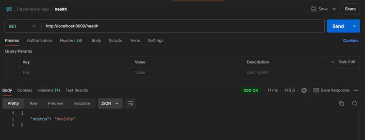
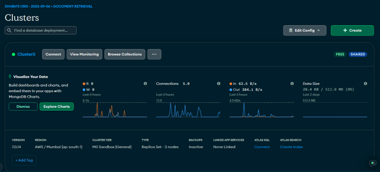
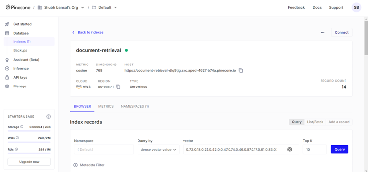
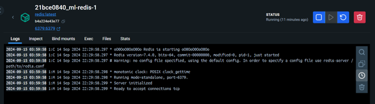
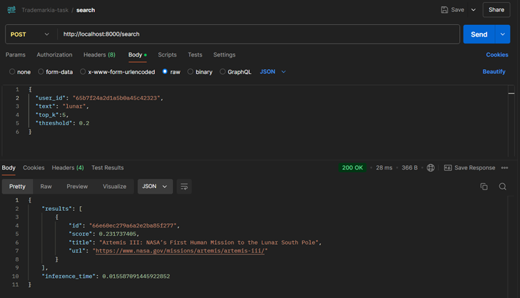
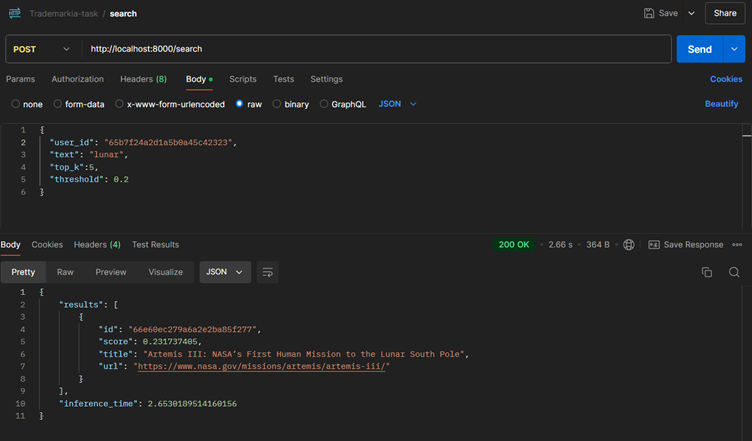
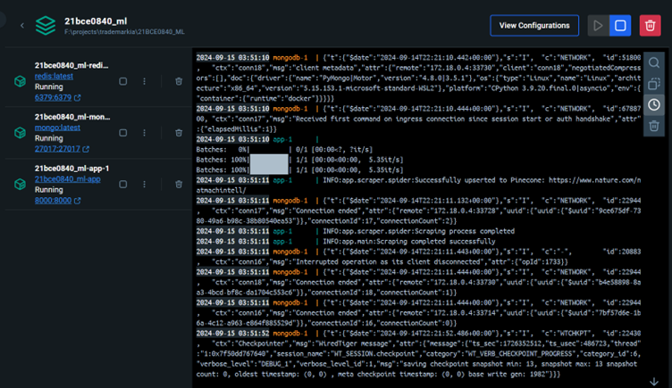
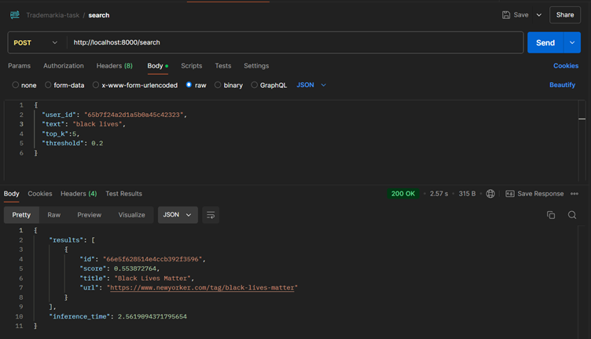
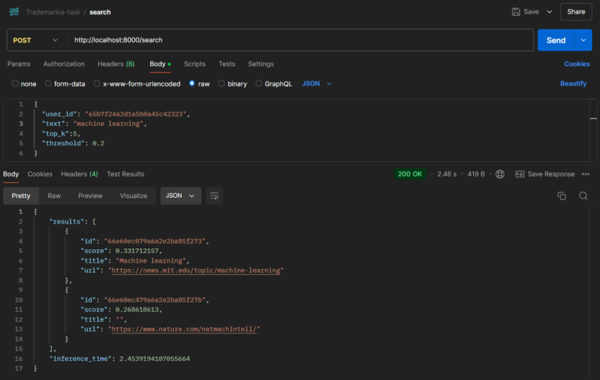
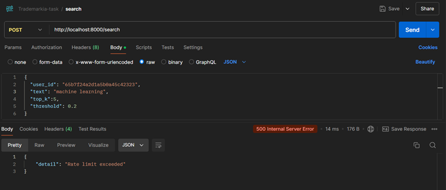

# 📚 Document Retrieval System

## 📋 Table of Contents
1. [Project Overview](#-project-overview)
2. [Features](#-features)
3. [Architecture](#-architecture)
4. [Tech Stack](#-tech-stack)
5. [Installation](#-installation)
6. [Usage](#-usage)
7. [API Endpoints](#-api-endpoints)
8. [Database](#-database)
9. [Caching](#-caching)
10. [Web Scraping](#-web-scraping)
11. [Docker Deployment](#-docker-deployment)
12. [Testing](#-testing)
13. [Performance Optimization](#-performance-optimization)
14. [API Testing Results](#-api-testing-results)
15. [Future Improvements](#-future-improvements)

## 🔍 Project Overview

This Document Retrieval System is a cutting-edge solution designed to provide contextual information for Large Language Models (LLMs) in chat applications. By leveraging advanced natural language processing techniques and optimized storage solutions, it efficiently retrieves relevant documents based on user queries.

## ✨ Features

- 🚀 Fast and accurate document retrieval
- 🕸️ Real-time web scraping of news articles
- 💾 Efficient caching mechanism for quick responses
- 🛡️ Rate limiting to prevent abuse
- 🐳 Dockerized for easy deployment
- 📊 Comprehensive error handling

## 🏗️ Architecture

Our system boasts a modular architecture, expertly separating concerns into different components:

1. 🌐 **API Layer**: Handles incoming requests and response formatting
2. 🧠 **Service Layer**: Implements core business logic
3. 💽 **Data Layer**: Manages interactions with databases and vector stores
4. 🕷️ **Scraper**: Continuously fetches new articles to keep the system updated
5. ⚡ **Caching Layer**: Improves response times for frequent queries

## 🛠️ Tech Stack

- Backend: Python with FastAPI 🐍
- Databases: 
  - MongoDB (for user data and request tracking) 🍃
  - Pinecone (for vector storage and similarity search) 🌲
- Caching: Redis 🗄️
- Scraping: Scrapy 🕷️
- Containerization: Docker 🐳
- API Testing: Postman 📬
- Embedding Model: DistilRoBERTa 🤖

### Embedding Model

We use the `distilroberta-base-msmarco-v2` model from the SentenceTransformers library for text embedding:

```python
from sentence_transformers import SentenceTransformer

model = SentenceTransformer('distilroberta-base-msmarco-v2')

def encode_text(text: str):
    news_text = f"news article: {text}"
    return model.encode(news_text).tolist()
```

This model provides efficient and accurate text embeddings for our document retrieval system.

## 🚀 Installation

1. Clone the repository:
   ```bash
   git clone https://github.com/shubhbansal9/21bce0840_ml.git
   cd document-retrieval-system
   ```

2. Set up a virtual environment:
   ```bash
   python -m venv venv
   source venv/bin/activate  # On Windows, use `venv\Scripts\activate`
   ```

3. Install dependencies:
   ```bash
   pip install -r requirements.txt
   ```

4. Set up environment variables:
   Copy `.env.example` to `.env` and fill in your configuration details.

## 🖥️ Usage

To run the application locally:

```bash
uvicorn app.main:app --reload
```

The API will be available at `http://localhost:8000`.

## 🔗 API Endpoints

1. **Health Check**
   - Endpoint: `/health`
   - Method: GET
   - Description: Returns a random response to check if the API is active.

   

2. **Search**
   - Endpoint: `/search`
   - Method: POST
   - Parameters:
     - `text` (string): The search query
     - `top_k` (int, optional): Number of results to fetch (default: 5)
     - `threshold` (float, optional): Similarity threshold (default: 0.1)
     - `user_id` (string): Unique identifier for the user
   - Description: Returns the top matching documents for the given query.

## 🗄️ Database

### MongoDB
Used for storing user information and tracking API usage.



### Pinecone
Vector database used for storing document embeddings and performing similarity searches.



## ⚡ Caching

Redis is used for caching frequent queries to reduce database load and improve response times.



### Caching Example




## 🕷️ Web Scraping

The system includes a background scraper that continuously fetches news articles to keep the document repository up-to-date.

Key components:
- `scraper/spider.py`: Defines the scraping logic
- `scraper/scheduler.py`: Manages the scheduling of scraping tasks

## 🐳 Docker Deployment

The application is containerized using Docker for easy deployment and scaling.

To build and run the Docker container:

```bash
docker-compose up --build
```



## 🧪 Testing

Run the test suite with:

```bash
pytest
```

The `tests/` directory contains unit and integration tests for various components of the system.


## 🚀 Performance Optimization

1. **Caching**: Frequently accessed results are cached in Redis to reduce computation time.
2. **Vector Search**: Pinecone is used for efficient similarity searches in high-dimensional space.
3. **Asynchronous Operations**: FastAPI's asynchronous capabilities are utilized for non-blocking I/O operations.

## 🔬 API Testing Results

This section presents the actual testing results of our Document Retrieval System's API endpoints, demonstrating their functionality and response format using Postman.

### 1. Health Check Endpoint

**Request:**
- Method: GET
- URL: `http://localhost:8000/health`

**Response:**
```json
{
  "status": "healthy"
}
```

### 2. Search Endpoint

#### 2.1 Search Query Example 1

**Request:**
- Method: POST
- URL: `http://localhost:8000/search`
- Body:
```json
{
  "user_id": "65b7f24a2d1a5b0a45c42323",
  "text": "black lives",
  "top_k":5,
  "threshold": 0.2
}
```
- Postman screenshot

  


#### 2.2 Search Query Example 2

**Request:**
- Method: POST
- URL: `http://localhost:8000/search`
- Body:
```json
{
  "user_id": "65b7f24a2d1a5b0a45c42323",
  "text": "machine learning",
  "top_k":5,
  "threshold": 0.2
}
```
- Postman screenshot

  

### 3. Rate Limiting Test

**Response (After exceeding rate limit):**



## 🚀 Future Improvements

1. 🧠 Implement a more sophisticated re-ranking algorithm for search results.
2. 🌍 Add support for multi-language document retrieval.
3. 🤖 Integrate with popular LLM platforms for seamless context injection.
4. 👍 Implement a user feedback mechanism to improve search relevance over time.

---

For any questions or support, please open an issue on the GitHub repository.
